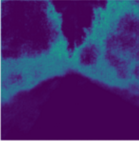

# Image-Segmentation
 Image Semantic Segmentaton using SegNet

 

## About

This project implements SegNet-based image semantic segmentation. Image segmentation is a computer vision and image processing technique that classifies or labels similar regions in an image from the pixel dimension, where each pixel region is represented by a class label or mask. Image segmentation is mainly divided into three types, namely semantic segmentation, instance segmentation and panoramic segmentation. 

Semantic segmentation is a deep learning algorithm that generates a correlation between a label or category and each pixel in an image, identifies the category of the pixel, and generates a collection of pixels based on the category the pixel belongs to. For example, self-driving cars need to recognize vehicles, pedestrians, traffic signs, sidewalks, and other road features, so semantic segmentation is used in real life for many practical applications, such as autonomous driving, medical imaging, and industrial inspection.

 

## Background

In the field of computer vision, Image Segmentation is the process of dividing an image into multiple image subfields with the purpose of simplifying or changing the representation of the image for classes, making the image easier to understand and analyze, and is often used to locate images objects and boundaries in . Image segmentation is similar to simulating the human brain to determine the type of objects in an image. If there is only one object in the image, we can build a simple classifier model to predict the object in a given image; if there are multiple objects in the image, we can train a multi-label classifier through Image Localization to identify the location of a single object in a given image and use the concept of Object Detection to predict the location and class of each object.

In image segmentation, an image has two main components: object and background. Objects correspond to countable objects in the image (e.g., people, flowers, birds, animals, etc.), while backgrounds represent similar features or amorphous regions with repeating patterns, which are uncountable objects (e.g., roads, sky, and grass) . Image segmentation is to divide an image into several disjoint regions based on features such as grayscale, color, spatial texture, geometric shape, etc., so that these features show consistency or similarity in the same region, but different regions. Noticeably different. In simple terms, image segmentation is to separate the target or object from the background.

 

## Problem Description

The main step of image processing is to divide the image into multiple regions for image processing. Since there may be areas in the image that do not contain any information, the entire image is not processed at the same time when the image segmentation program is executed, but the image is divided into multiple areas, and important areas are selected for image processing. An image is a collection of different pixels, and image segmentation can group pixels with similar properties together. Object detection establishes a bounding box of the corresponding class for each object in the image, but cannot know the exact shape of the object, only a set of coordinates of the bounding box can be obtained, while image segmentation can obtain the shape of all objects and their coordinates. Image segmentation creates a pixel-level mask for each object in the image, giving us a more granular understanding of the objects in the image.

Cancer has been a deadly disease for a long time. Even in this age of technological advancement, cancer can be fatal if not detected early, so detecting cancer cells in a short period of time could save millions of lives. The shape of the cancer cells plays a crucial role in determining the severity of the cancer, and maybe researchers have put these parts together for comparison, but object detection technology doesn't play a big role in that, and Only cell-shaped bounding boxes can be generated for cells, not helpful for object recognition. Image segmentation technology has had a huge impact on object recognition, helping humans solve problems in a more refined way, and making many meaningful contributions to the medical field.

In addition to the medical field, image segmentation is also widely used in other industries, such as traffic control systems, self-driving cars, object localization in satellite imagery, and other applications. Image segmentation techniques based on deep learning are mainly divided into two categories: semantic segmentation and instance segmentation. (2018) proposed a novel image segmentation technique called panoptic segmentation [1], sparking a debate on determining the best of the three (i.e. semantic vs instance vs panorama) image segmentation techniques . The difference between semantic segmentation, instance segmentation and panoptic segmentation is the way they deal with things in an image. This paper mainly focuses on the semantic segmentation in image segmentation.

Image semantic segmentation studies uncountable objects in an image, analyzing each image pixel and assigning a unique class label based on the feature represented by the pixel. As shown in Figure 1, the image contains two cars, multiple pedestrians, a road, and the sky. Each has the same characteristics between two vehicles and between multiple pedestrians. However, the output of image semantic segmentation cannot separately count the number of cars or pedestrians. Commonly used semantic segmentation techniques are SegNet, U-Net, DeconvNet and FCNs. This paper mainly discusses image semantic segmentation based on SegNet [3].

 

<h4 align="center">
​	Figure 1: Image Semantic Segmentation [2]
</h4>
 
 

## Solution

The goal of the experiment is to take an RGB color image $(height \times width \times 3)$ or a grayscale image $(height \times width \times 1)$ and output the resulting segmentation matrix, where each pixel in the matrix is an integer $(height \times width \times 1)$ representing a class label. Similar to how machine learning handles standard categorical values, the program will generate experimental results by one-hot encoding of class labels, with the core of creating an output channel for each class. Model performance is evaluated by taking the argmax of each pixel vector, and using the predicted values to generate a segmentation matrix, superimposing the predicted labels on the observations. When a single channel of the predicted label is covered, it is called a mask and is used to highlight regions in the image where a specific class exists.

A simple way to build a neural network architecture for image segmentation is to stack multiple convolutional layers with the same padding and output the final segmented image, where the purpose of setting multiple identical padding is to maintain size. The model directly learns the mapping from the input image to its corresponding segmentation through the continuous transformation of the feature map. However, the convolutional neural network based on image segmentation requires a huge amount of computation and time to achieve a fairly high accuracy.

The experiment mainly refers to the deep fully convolutional neural network architecture SegNet [3] proposed by Badrinarayanan et al. for image semantic segmentation, which is an image segmentation architecture using encoder and decoder type architectures. All 13 convolutional layers in this model use a pretrained VGG16 model as their encoder part, and for each encoder layer there is a corresponding decoder network that upsamples the image to its original size. During decoding, in order to upsample layers, SegNet is recalled on the corresponding encoder layer using the "pooling index of the max-pooling layer", making the training process easier as the network does not need to learn the upsampling weights again.

 

<h4 align="center">
​	Figure 2: Encoder and decoder structure of SegNet [3]
</h4>

 

 SegNet has only convolutional layers and does not contain fully connected layers. Since all fully connected layers are removed, the number of trainable parameters is reduced a lot. In SegNet, only the pooling index is transferred from the compression path to the expansion path, thus using less memory than other convolutional neural networks (such as U-Net) for image semantic segmentation. The role of the decoder network is to map the low-resolution encoder network feature map to the full input resolution feature map for classification from the pixel dimension.

 

## Algorithm Explanation

All pairs of encoders and decoders in SegNet are used to classify different resolutions and generate feature maps during the classification process. The semantic segmentation architecture consists of multiple combinations of an encoder network followed by a decoder network. The encoder is usually a pretrained classification network such as VGG or ResNet (VGG is used in our experiments), followed by a decoder network.

 

<h4 align="center">
​	Figure 3: Nut-shell architecture
</h4>

 

The encoder constructs 13 convolutional layers from the VGG16 model. Since SegNet removes the fully connected network, the number of network parameters is reduced from 134 million to 14.7 million. All encoders are shown in Figure 4. SegNet differs from other convolutional neural networks in the downsampling stage, while max pooling is used to achieve translation invariance on small spatial displacements in the image, combining this with downsampling objects will result in more per pixel The input image context information (i.e. the spatial window). 

These methods achieve better classification accuracy, but reduce the size of feature maps, resulting in blurred image boundaries and loss of image representation, which are not ideal for image segmentation. Therefore, in order to make the resolution of the expected output image to be the same as the resolution of the original input image, the model is up-sampled in the decoder, and more relevant information needs to be stored before the up-sampling operation, that is, captured in the encoder feature map. and store boundary information. 

To store this space efficiently, SegNet only stores the pooling index of the max-pooling layer, i.e., for each encoder map will store the position of the largest feature value in each pooling window, each of which occupies only 2 bits. The advantage of the encoder is to optimize the boundary division in the image and reduce the network parameters.

 

<h4 align="center">
​	Figure 4: Encoder architecture
</h4>

 

For all the 13 encoders, each has a corresponding decoder, where the decoder non-linearly upsamples the feature maps using the pooling indices of the max-pooling layer. As one of the core elements in SegNet, the decoder semantically maps the discriminative features (lower resolution) learned by the encoder to the pixel space (higher resolution) for dense classification. 

The decoder can help generate higher-resolution sparse feature maps, feed the sparse map into a trainable filter bank, and then generate a dense feature map and batch normalize the feature map. The last decoder in the model is connected to the Softmax layer, where the Softmax layer classifies each pixel and finally generates the output result map. 

The decoder corresponding to the first encoder in SegNet generates a multi-channel feature map, where the encoder input is three channels (RGB), while the other decoders in the network generate the same number of encoder inputs and Feature maps for large and small channels. 

The high-dimensional feature representation generated by the last decoder in the network will be used as the input of the Softmax layer, which is independently classified into different categories from the pixel dimension, and finally generates an output probability image of K channels, where K is the category for the data sample number. The maximum probability of each pixel for each class will be taken as the predicted image segmentation class.

 

## Algorithm Flowchart

 

 

## Result

#### **Labelled Mask and Predicted Mask of a Random Image from Test Set**

|              | 图像掩码 1                                                   | 图像掩码 2                                                   | 图像掩码 3                                                   | 图像掩码 4                                                   | 图像掩码 5                                                   | 图像掩码 6                                                   |
| ------------ | ------------------------------------------------------------ | ------------------------------------------------------------ | ------------------------------------------------------------ | ------------------------------------------------------------ | ------------------------------------------------------------ | ------------------------------------------------------------ |
| **原图像**   |  |  |  |  |  |  |
| **标签掩码** |  |  |  |  |  |  |
| **估计掩码** |  |  |  |  |  |  |

|              | 图像掩码 7                                                   | 图像掩码 8                                                   | 图像掩码 9                                                   | 图像掩码 10                                                  | 图像掩码 11                                                  | 图像掩码 12                                                  |
| ------------ | ------------------------------------------------------------ | ------------------------------------------------------------ | ------------------------------------------------------------ | ------------------------------------------------------------ | ------------------------------------------------------------ | ------------------------------------------------------------ |
| **原图像**   |  |  |  |  |  |  |
| **标签掩码** |  |  |  |  |  |  |
| **估计掩码** |  |  |  |  |  |  |

 

#### **Actual Segmented Image and Predicted Segmented Image of 4 Random Images from Test Set**

|              | 随机图像 1                                                   | 随机图像 2                                                   | 随机图像 3                                                   | 随机图像 4                                                   |
| ------------ | ------------------------------------------------------------ | ------------------------------------------------------------ | ------------------------------------------------------------ | ------------------------------------------------------------ |
| **原图**     |  |  |  |  |
| **标签掩码** |  |  |  |  |
| **估计掩码** |  |  |  |  |

 

#### **Iteration throughout Model Training**

|  |
| ------------------------------------------------------------ |

 

## Discussion

Using the SegNet model to train the data samples takes a significant amount of time, taking a total of about 49 hours using the CPU for 200 iterations. This is due to the huge number of parameters generated by the 13-layer convolutional network in SegNet. There are 29.44 million (29,443,968) parameters in the model that need to be trained, and fully optimizing these parameters requires a high number of iterations, so the training time of the model is longer. 

For deep convolutional neural networks, it is very common to spend 1-2 days training a large number of parameters, so we can modify some parameters from the code to shorten the training time. For a large number of data samples, if the ratio of training samples and test samples is increased, the training time can be greatly reduced, but at the cost of reduced model performance, so instead of setting the ratio of training samples to 0.8 or 0.9, set it to 0.7 helps reduce model training time. 

On the other hand, the number of convolutional layers in SegNet is also one of the key factors affecting the training time of the model. The pre-trained VGG16 model constructs 13 convolutional layers as the encoder part of SegNet, and trains 374 images of size in each iteration, and the average time per iteration is about 14 to 16 minutes.

The performance of the computer CPU and GPU is one of the factors that affects the training time of the model. In this experiment, the image semantic segmentation model SegNet is trained on the CPU. The CPU version is Intel Core i5, which has fewer cores and concurrent threads. Neither the Core i5 is designed nor positioned for demanding programs, so it can't match the performance of processors like the Core i7 and Core i9 of current generations. In view of the number of convolutional layers and the huge amount of parameters of the SegNet convolutional neural network, the Core i5 CPU of the computer can only spend a lot of time when training the model, which is not conducive to model training in terms of time cost.

After using the CPU to train the model, I tried to use colab to train the model on the GPU, and found that the efficiency of model training was greatly improved. The average time spent in each iteration was shortened from 15 minutes to 15 seconds, and the total running time was reduced from 49 hours to 1 hour. While CPUs can process tasks in a fast and orderly manner, GPUs are better suited for deep learning-based tasks than CPUs. GPUs use parallel computing to decompose a large number of complex problems into multiple small problems and compute these small problems simultaneously, so GPUs are more suitable for processing large-scale distributed computing processes in machine learning.

#### **Hardware factor that influences the time consumption of Model Learning**

| **使用CPU迭代运行训练模型200次所需时长** |  |
| ---------------------------------------- | ------------------------------------------------------------ |
| **使用GPU迭代运行训练模型200次所需时长** |  |

| Running code in Google Colab Jupyter Notebook using GPU |  |
| ------------------------------------------------------- | ------------------------------------------------------------ |

 

## Personal Summary

Through this project, I have learned how to use the SegNet structure to train an image semantic segmentation model, and improve the performance and efficiency of model training by adjusting parameters and improving computer hardware requirements. SegNet can train models with high accuracy in computer vision image segmentation, at the cost of time spent and better hardware performance. Image segmentation is widely used in many fields, such as autonomous driving, medical imaging and industrial inspection, and has made many contributions. It can be seen that image segmentation needs to be a sub-field of artificial intelligence that researchers need to pay attention to and study in depth.

 

### *References：*

[1]   Kirillov, Alexander and He, Kaiming and Girshick, Ross and Rother, Carsten and Dollár, Piotr. Panoptic Segmentation[J]. *https://arxiv.org/abs/1801.00868* , 2018.

[2]   Semantic Segmentation (Cars, Roads) [DB/OL]. *https://www.lotus-qa.com/image-annotation-semantic-segmentation/* .

[3]   Badrinarayanan, Vijay and Kendall, Alex and Cipolla, Roberto. SegNet: A Deep Convolutional Encoder-Decoder Architecture for Image Segmentation[J]. *https://arxiv.org/abs/1511.00561* , 2015.

